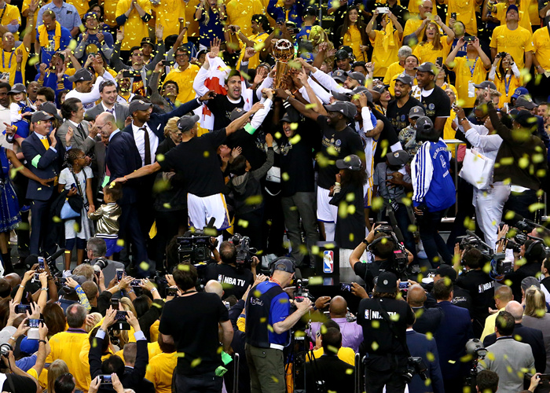
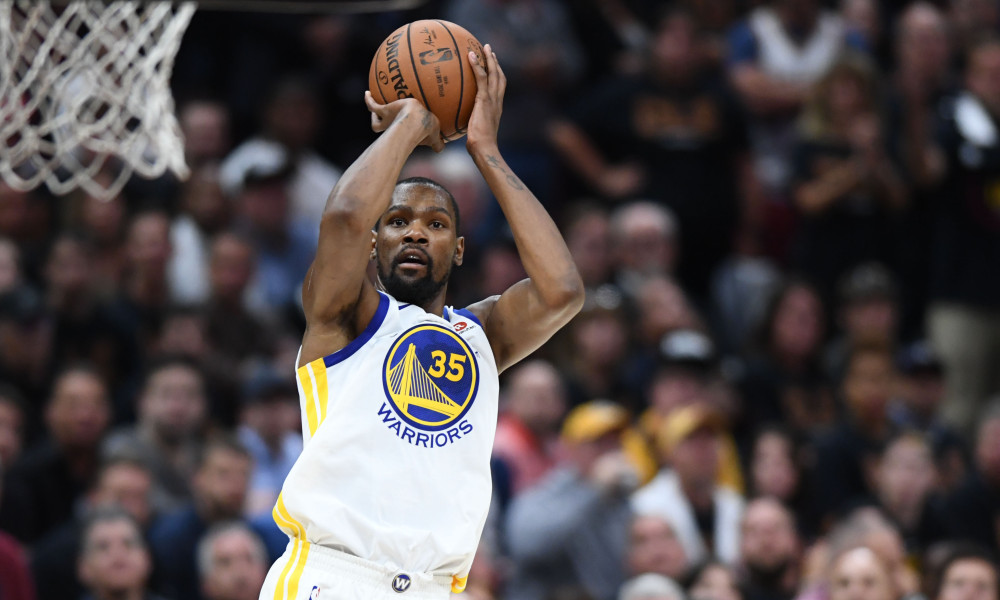
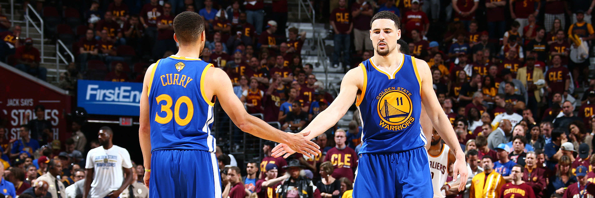
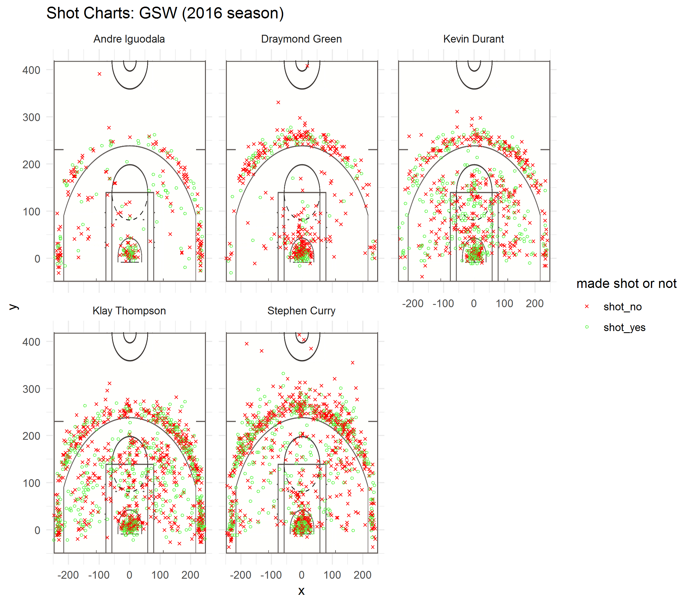

Workout 1
================
Wenkai Yang
2019-03-03

Introduction
------------

This report gives you a summary of shots data from Golden State Warriors' five star players (**Andre Iguodala**, **Draymond Green**, **Kevin Durant**, **Klay Thompson** and **Stephen Curry**) in the 2016-2017 season. By manipulating data and visualizig it, we can find some evidence to explain why Golden State Warriors could win the NBA Championship in that season.

Background and Motivation
-------------------------

Before 2016-2017 season began, Kevin Durant made the decision to join the Golden State Warriors, then Warriors were unstoppable in the following season. Finally, Warriors beat Cavaliers and won the final championship in 2016-2017 season.


<p class="caption">
*Warriors won the championship in 2016-2017 season*
</p>

As we know, in order to win the final champion, one team should have excellent offence. Therefore, we want to see how good the Warriors' offence is by analyzing the shots data from Golden State Warriors' five star players.

Effective Shooting Percentages
------------------------------

### Data Processing

First we use R to create three tables to display each player's 2-point field goal effective shooting percentage, 3-point field goal effective shooting percentage and overall field goal effective shooting percentage respectively. The R codes are attached below:

``` r
library(dplyr)
```

    ## 
    ## Attaching package: 'dplyr'

    ## The following objects are masked from 'package:stats':
    ## 
    ##     filter, lag

    ## The following objects are masked from 'package:base':
    ## 
    ##     intersect, setdiff, setequal, union

``` r
library(knitr)
#read data
shots_data <- read.csv("../data/shots-data.csv",stringsAsFactors = FALSE)

#create and display table of 2 PT  (arranged by percentage in descending order) 
two_pt <- shots_data %>% group_by(name) %>%
  summarise(
    total = length(shot_type[shot_type == "2PT Field Goal"]),
    made = length(shot_type[shot_type == "2PT Field Goal" & shot_made_flag == "shot_yes"]),
    perc_made = made/total
  ) %>%
  arrange(desc(perc_made))
  
kable(two_pt,caption = "2 PT Effective Shooting Percentage by Player")
```

| name           |  total|  made|  perc\_made|
|:---------------|------:|-----:|-----------:|
| Andre Iguodala |    210|   134|   0.6380952|
| Kevin Durant   |    643|   390|   0.6065319|
| Stephen Curry  |    563|   304|   0.5399645|
| Klay Thompson  |    640|   329|   0.5140625|
| Draymond Green |    346|   171|   0.4942197|

``` r
#create and display table of 3 PT  (arranged by percentage in descending order) 
three_pt <- shots_data %>% group_by(name) %>%
  summarise(
    total = length(shot_type[shot_type == "3PT Field Goal"]),
    made = length(shot_type[shot_type == "3PT Field Goal" & shot_made_flag == "shot_yes"]),
    perc_made = made/total
  ) %>%
  arrange(desc(perc_made))
  
kable(three_pt,caption = "3 PT Effective Shooting Percentage by Player")
```

| name           |  total|  made|  perc\_made|
|:---------------|------:|-----:|-----------:|
| Klay Thompson  |    580|   246|   0.4241379|
| Stephen Curry  |    687|   280|   0.4075691|
| Kevin Durant   |    272|   105|   0.3860294|
| Andre Iguodala |    161|    58|   0.3602484|
| Draymond Green |    232|    74|   0.3189655|

``` r
#create and display table of overall shots  (arranged by percentage in descending order) 
overall_pt <- shots_data %>% group_by(name) %>%
  summarise(
    total = length(shot_type),
    made = length(shot_type[shot_made_flag == "shot_yes"]),
    perc_made = made/total
  ) %>%
  arrange(desc(perc_made))
  
kable(overall_pt,caption = "Effective Shooting Percentage by Player (Overall Shots)")
```

| name           |  total|  made|  perc\_made|
|:---------------|------:|-----:|-----------:|
| Kevin Durant   |    915|   495|   0.5409836|
| Andre Iguodala |    371|   192|   0.5175202|
| Klay Thompson  |   1220|   575|   0.4713115|
| Stephen Curry  |   1250|   584|   0.4672000|
| Draymond Green |    578|   245|   0.4238754|

### Data Analysis

Let's look at the first table, it dispalys the 2-point field goal effective shooting percentage of each player. All five players' 2-point field goal effective shooting percentages are more than or nearly 50%. It is incredible! That means each of these five players have the strong ability to score when he is on the court. There is no reason that one team won't have good offence when it has 5 good offence players.

Futhermore, though Kevin Durant's 2-point field goal effective shooting percentage is not the highest, he tried almost three times 2-point shots as many as Andre Iguodala (who had the highest 2-point field goal effective shooting percentage) did. With lot of attempts, he could still keep relatively high shooting percentage, no wonder coach Kerr would always trust him to finish the final shot. Andre Iguodala had the highest 2-point field goal effective shooting percentage, it supported that he had the ability to play a significant role in some important games --- that's exactly what helped Warriors a lot in the finals. However, as for Draymond Green, we deduce that he might not be a top scorer because he didn't shoot a lot and the percentage was not very high.


<p class="caption">
*Kevin Durant*
</p>

Stephen Curry and Klay Thompson, whom we often called them "Splash Brothers", didn't have the 2-point field goal effective shooting percentage as high as Kevin Durant did, but both their 3-point field goal effective shooting percentages in that season were higher than 40%. It did prove that they are two of the greatest 3-point shooters in current NBA league. If one of them has "hot hand" in the game, it is possibly that Warriors will win the game. Also, it can explain why Warriors always have very high score in one game --- they can make so many threes!


<p class="caption">
*Splash Brothers*
</p>

We can also see that Draymond Green and Angre Iguodala were not good at shooting three. It is normal because it is impossible that everyone the team can shoot three well. When we watch the Warriors' games, we can find that they actually help the team more with their defence.

As for the last table, we can clearly see that the main scorers of Golden State Warriors are Kevin Durant, Stephen Curry and Klay Thompson because they took up a lot of shots. But we can't ignore the contribution of Andre Iguodala and Draymond Green since they should also be regarded as threats when Warriors get the ball.

Shot Chart
----------

Additionally, we create a facetted shot chart to show each player's shooting map.



From the shot chart, we can clearly see that Andre Iguodala and Draymond Green are not the main scorers, but Iguodala had the high possibility to seize the opportunity to convert the shots to score. Kevin Durant was really good at shooting mid-range shots, which actually is not the preferred shooting type in today's NBA league. But undoubtedly, he can use these mid-range shots to kill the games. Stephen Curry and Klay Thompson tried lots of threes and made many of them, which made them get high scores in one game easily. Plus, we can see that Curry's shooting range is a little bit longer than Thompson, which makes defence man harder to defence Curry.

One more interesting thing to notice is that Curry was more likely to attempt some long-distance or even logo shots. This happens mostly when a period is coming to an end, or he made a series of shots before and he thinks he is "hot hand".

Summary
-------

By analyzing Andre Iguodala, Draymond Green, Kevin Durant, Klay Thompson and Stephen Curry's shot data, we find that Kevin Durant, Klay Thompson and Stephen Curry attempt more shots and have the relatively high field goal shooting percentages. Their performance in the games will directly influence the result of the games. However, since Warriors have three top scorers, though one of them doesn't play well, it is highly enough to win the game with other two. Besides, Draymond Green and Andre Iguodala not only can help sharing with scoring tasks, but their defence is the essential part to make Warriors win the games.

However, in this season, even Warriors got another all-star player --- DeMarcus Cousins, they didn't play as well as before. The main reason I think is, Warriors lost their defence. Though they always get high score in one game, they also lost high score. So maybe they need more Andre Iguodala and Draymond Green to improve defence.


